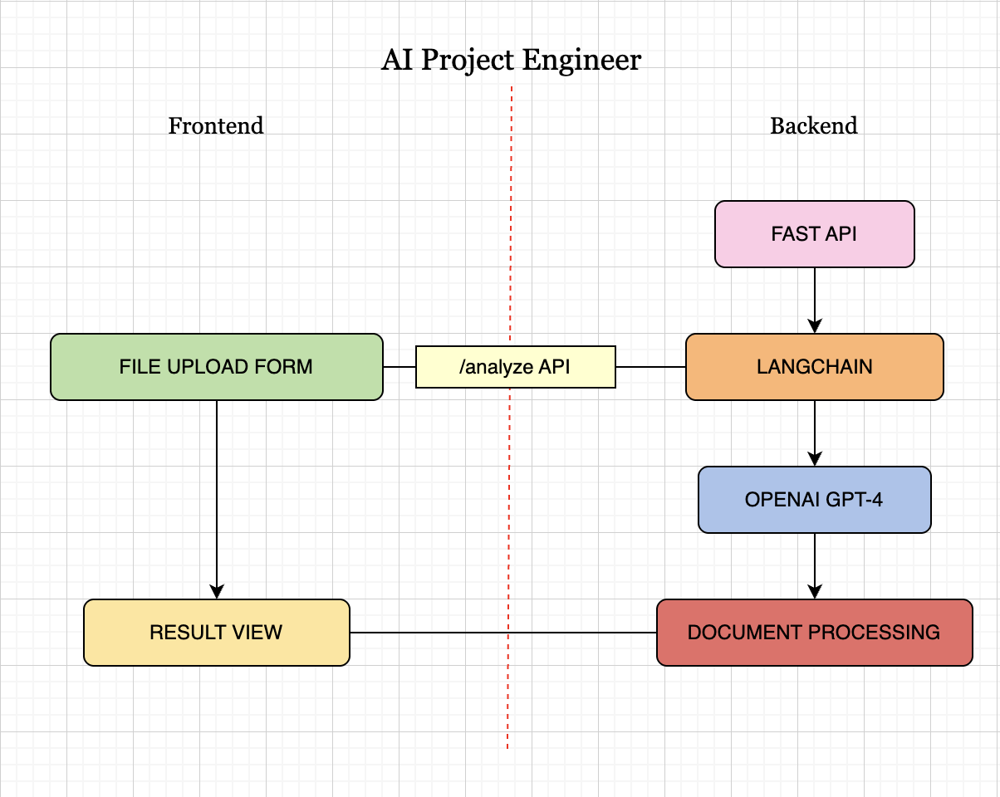
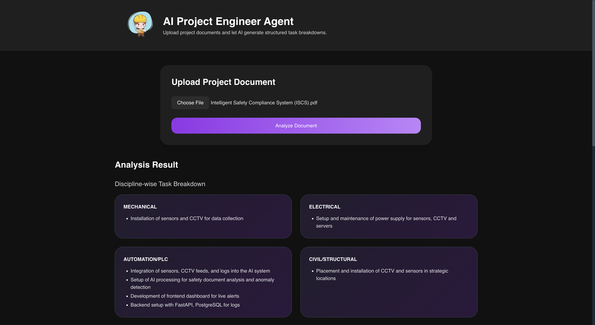
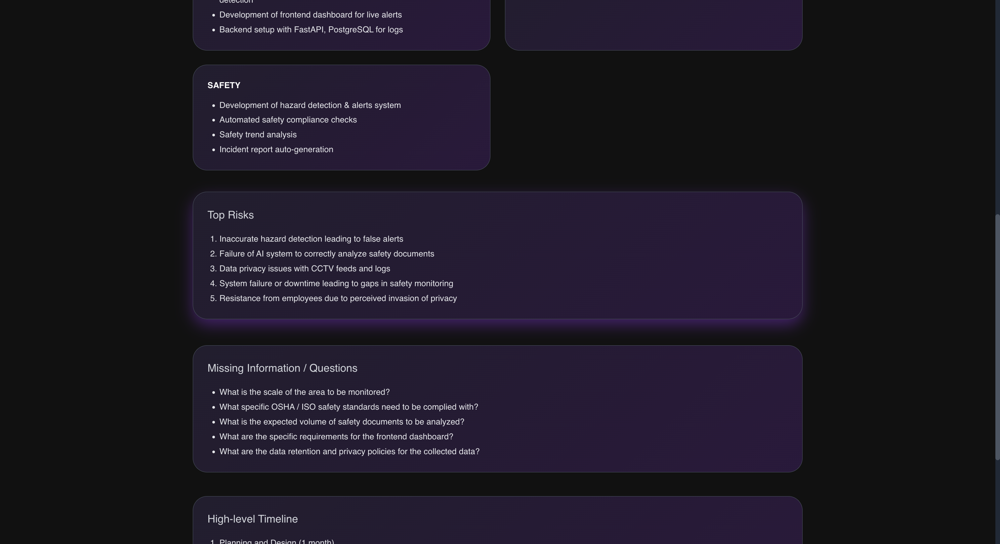
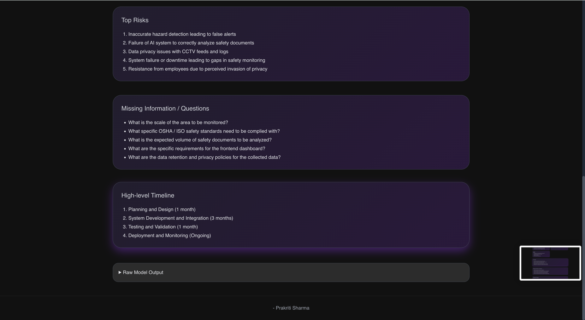

# AI Project Engineer Agent

## Overview

The **AI Project Engineer Agent** is an intelligent system designed to act as a **junior project engineer** for industrial and automation projects. It automates the process of analyzing project scope documents, technical specifications, and client requirements to produce structured outputs such as:

* Discipline-wise task breakdown (mechanical, electrical, automation/PLC, civil/structural, safety)
* Key execution risks
* Missing information or questions to ask the client
* High-level phased timeline for project execution

This project showcases how **AI agents can facilitate daily work in project execution and engineering**, significantly reducing manual document analysis, speeding up planning, and helping teams focus on implementation rather than paperwork.

---

## Motivation

Engineering projects in heavy industry often involve **large volumes of documents**, including:

* Technical specifications
* Scope of work
* P&ID drawings
* Emails and change requests

Human engineers spend hours extracting key tasks, identifying risks, and planning execution steps. The AI Project Engineer Agent automates this by **understanding documents and generating actionable insights**, acting as a “virtual project engineer” to assist teams in decision-making, planning, and coordination.

---

## Use Case

* **Project Managers:** Quickly obtain task breakdowns for resource allocation.
* **Site Engineers:** Identify missing information or ambiguous instructions.
* **Execution Teams:** Understand high-level timelines and potential risks before starting work.
* **Interns or New Hires:** Accelerate learning about project scope and responsibilities.

This solution is particularly relevant for companies like **John Cockerill** that focus on heavy engineering, automation, and execution of complex industrial projects.

---

## Project Structure

```
ai-project-engineer/
├─ frontend/                       # React + Tailwind frontend
│  ├─ package.json                 # Node dependencies
│  ├─ vite.config.js               # Vite configuration
│  ├─ index.html
│  ├─ postcss.config.cjs
│  ├─ tailwind.config.cjs
│  ├─ src/
│  │  ├─ main.jsx                  # React entry point
│  │  ├─ App.jsx                   # Main app component
│  │  ├─ api.js                    # Axios requests
│  │  ├─ index.css                 # Tailwind base styling
│  │  └─ components/
│  │     ├─ UploadForm.jsx         # File upload component
│  │     ├─ ResultView.jsx         # Display analysis results
│  │     └─ LoadingSpinner.jsx     # Spinner during analysis
│  └─ public/
│     └─ logo.svg                  # Demo logo
├─ backend/                        # FastAPI + LangChain backend
│  ├─ app/
│  │  ├─ main.py                   # FastAPI app
│  │  ├─ processor.py              # Document processing & LangChain integration
│  │  ├─ schemas.py                # Pydantic response schemas
│  │  └─ utils.py                  # PDF parsing and chunking utilities
│  ├─ requirements.txt             # Python dependencies
│  └─ .env.example                 # Environment variables template
└─ README.md                        # Project overview, motivation, instructions
```

---

## Project Architecture




## Tech Stack

**Frontend:**

* React 18 + Vite
* Tailwind CSS for styling
* Axios for HTTP requests

**Backend:**

* FastAPI (Python)
* LangChain for AI orchestration
* OpenAI GPT-4 as the language model
* PyPDF for PDF parsing
* Optional FAISS for vector storage / memory (future extension)

**Other Tools:**

* Python-dotenv for environment variables
* Uvicorn as ASGI server

---

## Step-by-Step Instructions to Run the Project

### 1. Clone or create the project

Create a folder `ai-project-engineer` and ensure you have the `frontend` and `backend` folders with all the files as described above.

---

### 2. Backend Setup

1. Navigate to `backend`:

```bash
cd ai-project-engineer/backend
```

2. Create a virtual environment and activate:

**macOS / Linux**

```bash
python3 -m venv .venv
source .venv/bin/activate
```

**Windows (PowerShell)**

```powershell
python -m venv .venv
.venv\Scripts\Activate.ps1
```

3. Upgrade pip and install dependencies:

```bash
python -m pip install --upgrade pip
pip install -r requirements.txt
```

4. Configure environment variables:

* Copy `.env.example` to `.env`

```bash
cp .env.example .env
```

* Set your OpenAI API key in `.env`:

```
OPENAI_API_KEY=sk-REPLACE_WITH_YOUR_KEY
OPENAI_MODEL=gpt-4
PORT=8000
```

5. Start the backend:

```bash
uvicorn app.main:app --reload --port 8000
```

You should see FastAPI running at `http://localhost:8000`. Verify health check at `http://localhost:8000/health`.

---

### 3. Frontend Setup

1. Navigate to `frontend`:

```bash
cd ../frontend
```

2. Install Node dependencies:

```bash
npm install
```

3. Start the React development server:

```bash
npm run dev
```

Vite will start the app (default URL: `http://localhost:3000`). Open this URL in your browser.

---

### 4. Test the Application

1. Upload a PDF or TXT file in the UI.
2. Click **Analyze**.
3. The backend calls OpenAI GPT-4 and returns a structured JSON containing:

* Discipline-wise task breakdown
* Top risks
* Missing questions
* High-level timeline
* Raw model output (for reference)

Results will display in the frontend immediately.

---

### Output Screenshots





### 5. Optional Enhancements

* Enable vector database (FAISS/Chroma) for long document retrieval and memory.
* Add authentication / authorization for secure API access.
* Export results as XLSX or PDF reports.
* Add sample demo documents for faster interview showcase.

---

## Motivation Recap

This project demonstrates how **AI agents can accelerate project execution**, reduce manual planning errors, and assist engineers in handling complex industrial documents. It is a perfect example of **practical AI application in heavy engineering** and can impress stakeholders during demos or interviews.
